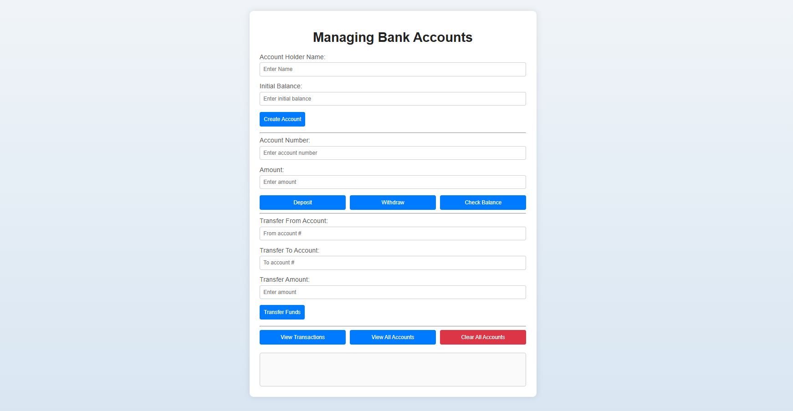

# Managing Bank Accounts App

## Content

Managing Bank Accounts app created to practice core javascript skills. You can add a new account holder and initial balance and it will be created and you can see it in the view all account screen.

You can also add or withdraw amounts to this account and transfer between different accounts.

Finally you can clear all accoutns and start again.
